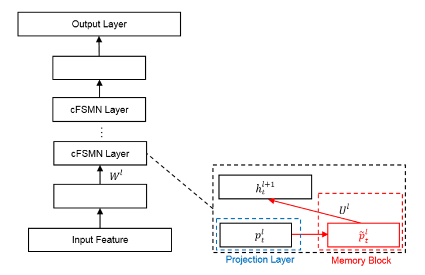

---
tasks:
- keyword-spotting
domain:
- audio
frameworks:
- kaldi
backbone:
- fsmn
metrics:
- Recall/FalseAlarm
license: Apache License 2.0
tags:
- Alibaba
- kws
- CTC
- Mind Speech KWS
datasets:
  evaluation:
  - pos_testsets_phone_xiaoyun
  - neg_testsets_phone_common
widgets:
  - task: keyword-spotting
    inputs:
      - type: audio 
        name: input 
        title: 音频 
    parameters:
      - type: string
        name: keywords
        title: 唤醒词
    examples:
      - name: 1
        title: 示例1 
        inputs:
          - name: input
            data: git://example/kws_xiaoyunxiaoyun.wav
        parameters:
          - name: keywords
            value: 小云小云
    inferencespec:
      cpu: 1 #CPU数量
      memory: 1024 
---

# 语音唤醒模型介绍


## 模型描述

移动端语音唤醒模型，检测关键词为“小云小云”。
模型网络结构继承自[论文](https://www.isca-speech.org/archive/interspeech_2018/chen18c_interspeech.html)《Compact Feedforward Sequential Memory Networks for Small-footprint
Keyword Spotting》，其主体为4层cFSMN结构(如下图所示)，参数量约750K，适用于移动端设备运行。  
模型输入采用Fbank特征，训练阶段使用CTC-loss计算损失并更新参数，输出为基于char建模的中文全集token预测，token数共2599个。  
测试工具根据每一帧的预测数据进行后处理得到输入音频的实时检测结果。  
模型训练采用"basetrain + finetune"的模式，basetrain过程使用大量内部移动端数据，在此基础上，使用1万条设备端录制安静场景“小云小云”数据进行微调，得到最终面向业务的模型。  
由于采用了中文char全量token建模，并使用充分数据进行basetrain，本模型支持基本的唤醒词/命令词自定义功能，但具体性能无法评估。  
后续将支持用户在basetrain模型基础上，使用其他关键词数据进行微调，得到新的语音唤醒模型。  


## 使用方式和范围

运行范围：
- 现阶段只能在Linux-x86_64运行，不支持Mac和Windows。

使用方式：
- 使用附带的kwsbp工具(Linux-x86_64)直接推理，分别测试正样本及负样本集合，综合选取最优工作点。

使用范围:
- 移动端设备，Android/iOS型号或版本不限，使用环境不限，采集音频为16K单通道。

目标场景:
- 移动端APP用到的关键词检测场景。


### 如何使用

- 无


#### 代码范例
```python
from modelscope.pipelines import pipeline
from modelscope.utils.constant import Tasks

kwsbp_16k_pipline = pipeline(
    task=Tasks.keyword_spotting,
    model='damo/speech_charctc_kws_phone-xiaoyun')
kws_result = kwsbp_16k_pipline(audio_in='data/test/audios/kws_xiaoyunxiaoyun.wav')
print(kws_result)
```

### 模型局限性以及可能的偏差

- 考虑到正负样本测试集覆盖场景不够全面，可能有特点场合/特定人群唤醒率偏低或误唤醒偏高问题。


## 训练数据介绍

- 无


## 模型训练流程

- 无


### 预处理

- 无


## 数据评估及结果

- 模型在自建9个场景各50句的正样本集（共450条）测试，唤醒率为93.11%；  
在自建的移动端负样本集上测试，误唤醒为40小时0次。

## 相关论文以及引用信息

```BibTeX
@inproceedings{chen18c_interspeech,
  author={Mengzhe Chen and ShiLiang Zhang and Ming Lei and Yong Liu and Haitao Yao and Jie Gao},
  title={{Compact Feedforward Sequential Memory Networks for Small-footprint Keyword Spotting}},
  year=2018,
  booktitle={Proc. Interspeech 2018},
  pages={2663--2667},
  doi={10.21437/Interspeech.2018-1204}
}
```